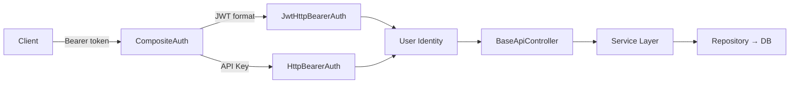

# Walkthrough: API Integration with Authentication

## What Was Done

Created **7 reference code files** in `docs/api/` (62KB total) covering complete REST API integration with dual authentication for the Yii2 task-manager.

## Files Created

| File | Size | Content |
|------|------|---------|
| [01-setup-config.md](file:///c:/wamp64/www/task-manager/docs/api/01-setup-config.md) | 5.9KB | `.env`, bootstrap, app config, module, entry point |
| [02-jwt-authentication.md](file:///c:/wamp64/www/task-manager/docs/api/02-jwt-authentication.md) | 7.1KB | `JwtHelper` (pure PHP HMAC-SHA256), `JwtHttpBearerAuth` |
| [03-bearer-token-auth-service.md](file:///c:/wamp64/www/task-manager/docs/api/03-bearer-token-auth-service.md) | 13.5KB | `ApiToken` model, migration, User model changes, `ApiAuthService` |
| [04-controllers.md](file:///c:/wamp64/www/task-manager/docs/api/04-controllers.md) | 13.8KB | `BaseApiController`, `AuthController`, `TaskController` |
| [05-error-handling-rate-limiting.md](file:///c:/wamp64/www/task-manager/docs/api/05-error-handling-rate-limiting.md) | 5.8KB | `ApiErrorHandler`, `ApiResponse`, `RateLimitInterface` |
| [06-sensitive-data-protection.md](file:///c:/wamp64/www/task-manager/docs/api/06-sensitive-data-protection.md) | 11.1KB | `DataEncryptor`, `EncryptedFieldBehavior`, `DataMasker`, `DataSigner` |
| [07-setup-guide.md](file:///c:/wamp64/www/task-manager/docs/api/07-setup-guide.md) | 5.0KB | Step-by-step setup, file mapping, test commands |

## Architecture

## Skills Used
`api-patterns`, `api-security-best-practices`, `architecture`, `backend-dev-guidelines`

## SOLID Compliance

| Principle | Implementation |
|-----------|---------------|
| **SRP** | Controller (HTTP) / Service (logic) / Repository (DB) separated |
| **OCP** | Module versioning `v1/v2`, CompositeAuth extensible |
| **LSP** | `ApiAuthServiceInterface` → any implementation works |
| **ISP** | `AuthServiceInterface` (session) ≠ `ApiAuthServiceInterface` (token) |
| **DIP** | Controllers depend on interfaces, DI container resolves |

## Next Steps
User applies code from `docs/api/` into source, runs migration, and tests endpoints per `07-setup-guide.md`.
